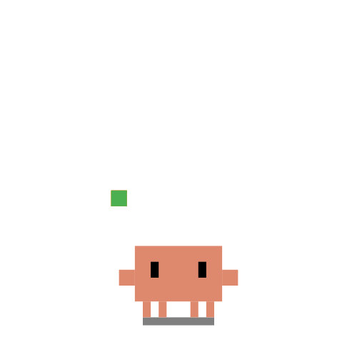

# Claw'dii

Un pet de escritorio para Windows que vive en la barra de tareas y reacciona en tiempo real a lo que está haciendo Claude Code.


## ¿Qué hace?

Claw'dii es un cangrejo pixel-art animado que se conecta a Claude Code mediante hooks y muestra visualmente el estado del agente:

| Estado Claude Code | Sprite | Descripción |
|---|:---:|---|
| Pensando |    | Uno de: pensando, dirigiendo, haciendo malabares |
| Escribiendo código |  | Tecleando |
| Leyendo / buscando archivos |  | Detective con lupa |
| Buscando en la web |  | Antena con ondas |
| Ejecutando comandos |  | Construcción |
| Esperando respuesta |  | Notificación |
| Respuesta completada |  | Chispas de alegría → idle |
| Inactivo 2 min |  | Durmiendo |
| Vagabundeando |  | Pasea por la barra de tareas |
| Límite de uso alcanzado |  | Sobrecalentado |
| Nueva sesión / `/clear` |  | Animación de aparecer desde el suelo |
| Sesión cerrada |  | Animación de excavar y desaparecer |

También reacciona a **sub-agentes**: cuando Claude lanza agentes paralelos, aparecen cangrejos mini que vagan cerca del principal.

## Requisitos

- **Windows 10/11**
- **Python 3.10+**
- **Claude Code** instalado y configurado

## Instalación

```bash
git clone https://github.com/FlashBacKB9/Clawdii.git
cd Clawdii
python install.py
```

El instalador:
1. Instala `PySide6` y `PySide6-WebEngine` via pip
2. Añade los hooks en `~/.claude/settings.json` automáticamente

Después de instalar, **reinicia Claude Code** o abre una nueva sesión. El cangrejo aparecerá solo.

## Instalación vía Claude Code

Si ya tienes Claude Code abierto, pégale esto directamente en el chat:

```
Clona https://github.com/FlashBacKB9/Clawdii.git en una carpeta temporal y ejecuta el instalador con Python. El instalador instala las dependencias y configura los hooks automáticamente. Cuando termine, reinicia Claude Code y aparecerá un cangrejo en la barra de tareas.
```

Claude Code se encargará de clonar el repo y ejecutar `python install.py`.

## Uso

- **Clic izquierdo** → enfoca la ventana de Claude Code asociada
- **Clic derecho** → menú con opciones:
  - 📌 Quieto — desactiva el vagabundeo
  - Cerrar — cierra el pet con animación

## Estructura del proyecto

```
Clawdii/
├── clawd_daemon.py     # Proceso principal (ventana Qt + lógica de estados)
├── clawd_hook.py       # Hook de Claude Code → envía eventos al daemon
├── install.py          # Instalador automático
└── assets_svg/         # Sprites SVG animados
```

## Desinstalar

Elimina las entradas de `clawd_hook.py` de `~/.claude/settings.json` y borra la carpeta del proyecto.

---

## Créditos

**Proyecto, código e integración con Claude Code:** [Guillermo López](https://github.com/FlashBacKB9) — hooks, lógica de estados, calibración de sprites, menú simplificado (sin controles de posición ni modo debug), fix de transparencia en Windows 11

**Assets SVG:** [marciogranzotto/clawd-tank](https://github.com/marciogranzotto/clawd-tank) — sprites pixel-art del cangrejo animado

**Lógica de estados de sub-agentes:** inspirada en [pablodelucca/pixel-agents](https://github.com/pablodelucca/pixel-agents)

---

## Otros proyectos del autor

Si te ha gustado Claw'dii, echa un vistazo a estos otros proyectos:

**StorageDex** — Organiza tus cajas de almacenamiento con un inventario visual 3D. Disponible en Android.  
[](https://play.google.com/store/apps/details?id=com.flashbackb9.storagedex)

**Caulky** — App de finanzas personales. Backend FastAPI + PostgreSQL, autoalojada.  
[](https://github.com/FlashBacKB9/Caulky)

---

## Licencia

[CC BY-NC-SA 4.0](https://creativecommons.org/licenses/by-nc-sa/4.0/)

Libre para usar y modificar, **sin uso comercial**. Las obras derivadas deben:
- Mantener la misma licencia (CC BY-NC-SA 4.0)
- Dar crédito a [Guillermo López](https://github.com/FlashBacKB9) (este proyecto)
- Dar crédito a [marciogranzotto](https://github.com/marciogranzotto/clawd-tank) (assets SVG originales)
